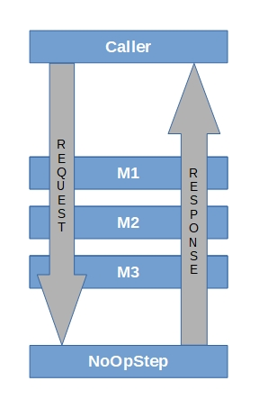

# Pipelines

[](https://github.com/mytrout/Pipelines/actions/workflows/build-pipelines-core.yaml)
[](https://www.nuget.org/packages/MyTrout.Pipelines/)
[](https://github.com/mytrout/Pipelines/stargazers)
[](https://github.com/mytrout/Pipelines/network)
[](https://github.com/mytrout/Pipelines/blob/master/LICENSE)

[](https://sonarcloud.io/dashboard?id=Pipelines.Core)
[](https://sonarcloud.io/dashboard?id=Pipelines.Core)
[](https://sonarcloud.io/dashboard?id=Pipelines.Core)
[](https://sonarcloud.io/dashboard?id=Pipelines.Core)
[](https://sonarcloud.io/dashboard?id=Pipelines.Core)

## Introduction

MyTrout.Pipelines provides a non-HTTP pipeline similar to the ASP.NET Core request pipeline.

MyTrout.Pipelines targets [.NET 6.0](https://dotnet.microsoft.com/download/dotnet/6.0) and [.NET 7.0](https://dotnet.microsoft.com/download/dotnet/7.0)

If three steps named M1, M2, and M3 were added to the Pipeline, here is the execution path for the code.



The Pipeline automatically adds the NoOpStep as the last step in the Pipeline.

For more details on implementing Pipelines.Steps, see [Pipelines.Steps.Core](../Steps/Core/README.md)

For more details on implementing Pipelines.Hosting, see [Pipelines.Hosting](../Hosting/README.md)

## Installing via NuGet

    Install-Package MyTrout.Pipelines

## Software dependencies
    1. Microsoft.Extensions.Configuration.Abstractions 6.0.0
    2. Microsoft.Extensions.Configuration.Binder 6.0.0
    3. Microsoft.Extensions.DependencyInjection.Abstractions 6.0.0
    4. Microsoft.Extensions.Logging.Abstractions 6.0.0

All software dependencies listed above use the [MIT License](https://licenses.nuget.org/MIT).

## BREAKING CHANGES INTRODUCED WITH 3.0.0

See [Breaking Changes for 3.0.0](./breaking-changes-3-0-0.md)

## How do I use Pipelines?

### PLEASE NOTE: 
* This example does not use ASP.NET Hosting or Generic Hosting to implement a pipeline.
* For Console Applications, please use [Pipelines.Hosting](../Hosting/README.md)
* For Pipeline Processes running within ASP.NET Core websites, there is no current recommendation.

```csharp

namespace MyTrout.Pipelines.Samples.Simple
{
    using Microsoft.Extensions.Configuration;
    using Microsoft.Extensions.DependencyInjection;
    using Microsoft.Extensions.Logging;
    using MyTrout.Pipelines;
    using MyTrout.Pipelines.Core;
    using System;
    using System.Threading.Tasks;
    using System.Linq;

    public class Program
    {
        static async Task Main()
        {
            // For this simple example, nothing needs to be configured, but the IConfiguration root is required.
            var config = new ConfigurationBuilder()
                            .Build();
            
            var serviceProvider = new ServiceCollection()
                                            .AddLogging();
                                            .AddTransient<IStepActivator, StepActivator>();
                                            .AddScoped<IConfiguration>(_ => config) 
                                            .Build();

            // Steps are added in the order they are executed on the request side
            // and will be executed in reverse on the response side.
            var builder = new PipelineBuilder()
                            .AddStep<M1>()
                            .AddStep<M2>()
                            .AddStep<M3>();
    
            // Build the pipeline and instantiate all steps.
            var stepActivator = serviceProvider.GetService<IStepActivator>();

            var pipeline = builder.Build(stepActivator);

            // Any name-value pairs that are required during execution would be loaded here.
            var context = new PipelineContext();
    
            // Execute the pipeline and wait for results.
            await pipeline.InvokeAsync(context).ConfigureAwait(false);

            if(context.Errors.Any())
            {
                // Throw the first exception generated by the pipeline execution.
                throw context.Errors[0];
            }
        }
    }

    public class M1 : IPipelineRequest
    {
        private readonly IPipelineRequest next;

        public M1(IPipelineRequest next) => this.next = next;

        protected virtual string Message => "I";

        public ValueTask DisposeAsync()
        {
            return new ValueTask(Task.CompletedTask);
        }

        public Task InvokeAsync(IPipelineContext context)
        {
            if (context == null)
            {
                throw new ArgumentNullException(nameof(context));
            }

            if (context.Items.ContainsKey("Message"))
            {
                context.Items["Message"] += $" {this.Message}";
            }
            else
            {
                context.Items.Add("Message", this.Message);
            }

            return this.next.InvokeAsync(context);
        }
    }

    public class M2 : M1
    {
        public M2(IPipelineRequest next) : base(next)
        {
            // no op
        }

        protected override string Message => "AM";
    }

    public class M3 : M1
    {
        public M3(IPipelineRequest next) : base(next)
        {
            // no op
        }

        protected override string Message => "HERE!";
    }
}
```

The previous code would execute per the text below:

* M1 Step - All code in M1.InvokeAsync() before the call to this.next.InvokeAsync().
* M2 Step - All code in M2.InvokeAsync() before the call to this.next.InvokeAsync().
* M3 Step - All code in M3.InvokeAsync() before the call to this.next.InvokeAsync().

* NoOpStep - Returns a CompletedTask to start the Response side of the Pipeline.

* M3 Step - All code in M3.InvokeAsync() after the call to this.next.InvokeAsync().
* M2 Step - All code in M2.InvokeAsync() after the call to this.next.InvokeAsync().
* M1 Step - All code in M1.InvokeAsync() after the call to this.next.InvokeAsync().

The result of the execution as defined above is a string named "Message" in PipelineContext.Items with the value "I AM HERE!";

## How do I write Steps?
Please refer to the [Pipeline.Steps.Core](../Steps/Core/README.md) for more details on how to write steps.

## Build the software locally.
    1. Clone the software from the Pipelines repository.
    2. Build the software in Visual Studio 2019 v16.8 or higher to pull down all of the dependencies from nuget.org.
    3. In Visual Studio, run all tests.  All of the should pass.
    4. If you have Visual Studio Enterprise 2019, analyze the code coverage; it should be 100%.

