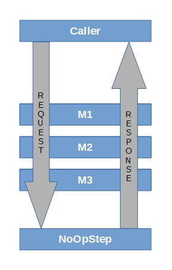

# Pipelines

## Introduction
Provides a non-HTTP pipeline similar to the ASP.NET Core request pipeline.

MyTrout.Pipelines targets [.NET 6.0](https://dotnet.microsoft.com/download/dotnet/6.0)

If three steps named M1, M2, and M3 were added to the Pipeline, here is the execution path for the code.

The Pipeline automatically adds the NoOpStep as the last step in the Pipeline.

## BREAKING CHANGES INTRODUCED WITH 4.0.0

See [Breaking Changes for 4.0.0](./docs/pipelines-core-breaking-changes-4-0-0.md)

## Installing via NuGet

    Install-Package MyTrout.Pipelines

## Software dependencies
    1. Microsoft.Extensions.Configuration.Abstractions 6.0.0
    2. Microsoft.Extensions.Configuration.Binder 6.0.0
    3. Microsoft.Extensions.DependencyInjection.Abstractions 6.0.0
    4. Microsoft.Extensions.Logging.Abstractions 6.0.0

All software dependencies listed above use the [MIT License](https://licenses.nuget.org/MIT).

## How do I use Pipelines?
Please refer to the [Pipelines.Core](./Core/README.md) for details on the basics of how to use Pipelines.

## How do I write Steps?
Please refer to the [Steps](./Steps/README.md) for more details on how to write steps.

## How do I use Pipelines with Console Applications / Generic Host?
Please refer to the [Pipeline.Hosting](./Hosting/README.md) for more details on how to use Pipelines with Console applications.

## Build the software locally.
    1. Clone the software from the Pipelines repository.
    2. Build the software in Visual Studio 2022 v17.0 or higher to pull down all of the dependencies from nuget.org.
    3. In Visual Studio, run all tests.  All of the should pass.
    4. If you have Visual Studio Enterprise 2022, analyze the code coverage; it should be 100%.

## Build the software in Github
    TODO ->

## More Documentation!

* [Non-breaking Changes for 4.0.1](./docs/pipelines-core-nonbreaking-changes-4-0-1.md)
* [Breaking Changes for 4.0.0](./docs/pipelines-core-breaking-changes-4-0-0.md)
* [Repairing DACPAC in March 2022](./docs/repairing-dacpac-build-after-march-2022-failures.md)
* [OpenCover is Dead!  Long Live AltCover](./docs/opencover-is-dead-long-live-altcover.md)
* [Breaking Changes for 3.0.0](./docs/pipelines-core-breaking-changes-3-0-0.md)
* [Github Actions and .NET 5.0](./docs/github-actions-and-net-5.0.md)
* [Git Prune Automatically in Visual Studio](./docs/why-does-visualstudio-retain-deleted-remote-branches.md)
